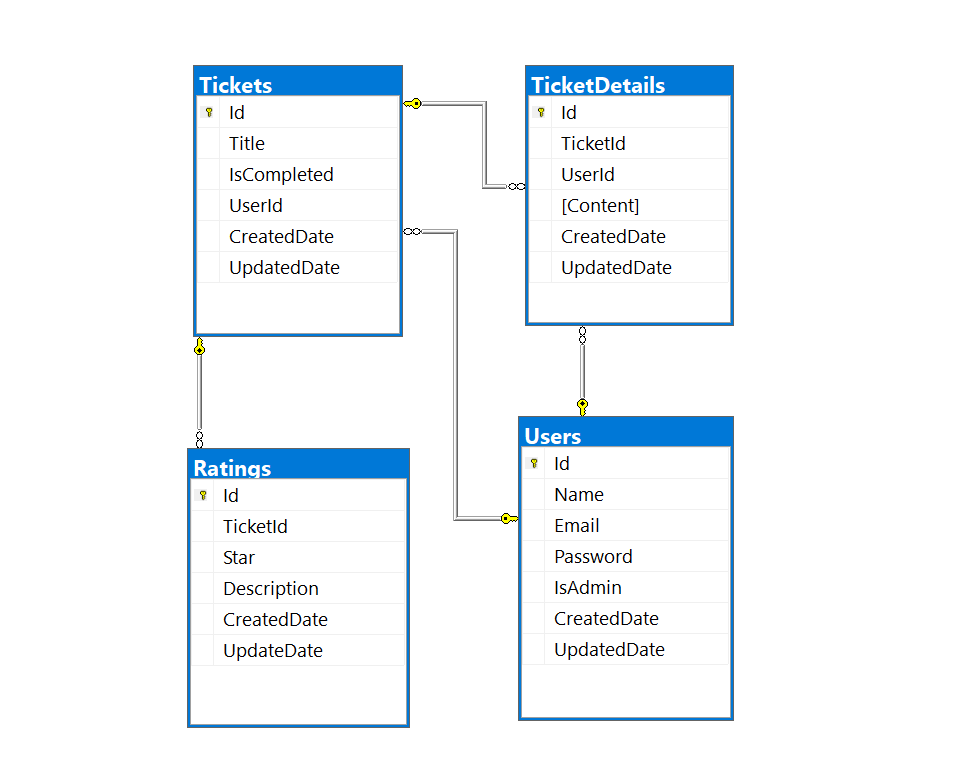

# ITDeskDB Veritabanı Projesi

Bu README dosyası, **ITDeskDB** adlı veritabanı tasarımını açıklamak ve içerdiği tablolar arasındaki ilişkiyi anlatmak için hazırlanmıştır.

## Veritabanı Tanıtımı

ITDeskDb veritabanı, IT destek taleplerini merkezi bir şekilde yönetmek için tasarlanmıştır. Kullanıcılar, destek taleplerini oluşturabilir, takip edebilir ve bu taleplere yıldız derecelendirmesi ve yorum ekleyebilirler. Veritabanı, kullanıcılar, talepler, derecelendirmeler ve talep detaylarına dair bilgileri içerir.

## Portfolyo Veritabanı Diyagramı

## Tablolar ve Alanlar

1. **Tickets Tablosu:**
   - Id (int): Destek talebi kaydının benzersiz tanımlayıcısı.
   - Title (varchar): Destek talebinin başlığı.
   - IsCompleted (bit): Talebin tamamlanıp tamamlanmadığını belirten bayrak.
   - UserId (int): Talebi oluşturan kullanıcının kimliği.
   - CreatedDate (datetime): Talebin oluşturulma tarihi.
   - UpdatedDate (datetime): Talebin son güncelleme tarihi.

2. **Users Tablosu:**
   - Id (int): Kullanıcının benzersiz tanımlayıcısı.
   - Name (varchar): Kullanıcının adı.
   - Email (varchar): Kullanıcının e-posta adresi.
   - Password (varchar): Kullanıcının şifresi.
   - IsAdmin (bit): Kullanıcının yönetici olup olmadığını belirten bayrak.
   - CreatedDate (datetime): Kullanıcının oluşturulma tarihi.
   - UpdatedDate (datetime): Kullanıcının son güncelleme tarihi.

3. **Ratings Tablosu:**
   - Id (int): Derecelendirme kaydının benzersiz tanımlayıcısı.
   - TicketId (int): Derecelendirmenin ilişkilendirildiği destek talebinin benzersiz tanımlayıcısı.
   - Star (int): Talebe verilen yıldız derecelendirmesi.
   - Description (varchar): Derecelendirmeye eklenen açıklama.
   - CreatedDate (datetime): Derecelendirmenin oluşturulma tarihi.
   - UpdateDate (datetime): Derecelendirmenin son güncelleme tarihi.

4. **TicketDetails Tablosu:**
   - Id (int): Talep detayının benzersiz tanımlayıcısı.
   - TicketId (int): Talep detayının ilişkilendirildiği destek talebinin benzersiz tanımlayıcısı.
   - UserId (int): Talep detayını oluşturan kullanıcının benzersiz tanımlayıcısı.
   - Content (varchar): Talep detayının içeriği.
   - CreatedDate (datetime): Talep detayının oluşturulma tarihi.
   - UpdatedDate (datetime): Talep detayının son güncelleme tarihi.

## İlişkiler

- Tickets tablosundaki UserId alanı, Users tablosundaki Id alanına referans verir.
- Ratings tablosundaki TicketId alanı, Tickets tablosundaki Id alanına referans verir.
- TicketDetails tablosundaki TicketId alanı, Tickets tablosundaki Id alanına referans verir.
- TicketDetails tablosundaki UserId alanı, Users tablosundaki Id alanına referans verir.

## Prosedürler ve Görünümler

- CreateTicket Prosedürü: Yeni bir destek talebi oluşturur.
- GetTicketsByPageSize Prosedürü: Belirli bir sayfa boyutunda destek taleplerini getirir.
- TicketView Görünümü: Tickets ve Users tablolarını birleştirerek destek taleplerini görüntüler.
- UserTicketReports Görünümü: Kullanıcılarla ilgili istatistiksel bilgileri içerir.
- TicketReports Görünümü: Tickets, Users ve Ratings tablolarını birleştirerek destek taleplerini ve derecelendirmeleri görüntüler.

## Veritabanının Kurulumu

1. Veritabanını oluşturmak için script dosyasını SQL Server Management Studio veya benzeri bir araçla çalıştırın.
2. Projeyi yerel makinenizde veya sunucunuzda çalıştırın.
3. Veritabanına erişim kodları ve bağlantı detayları eklemeyi unutmayın.
